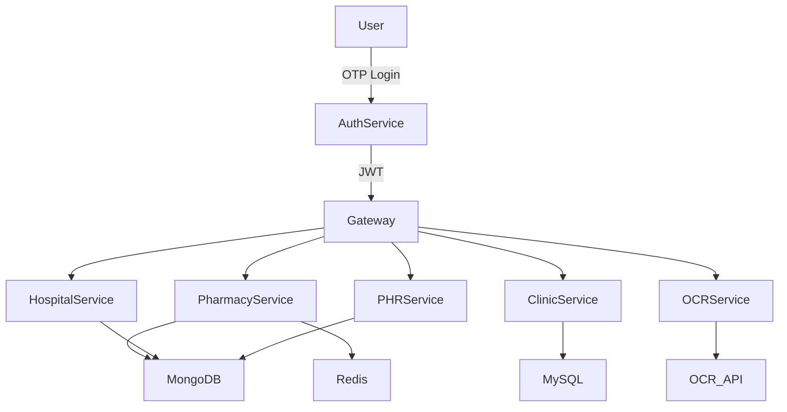
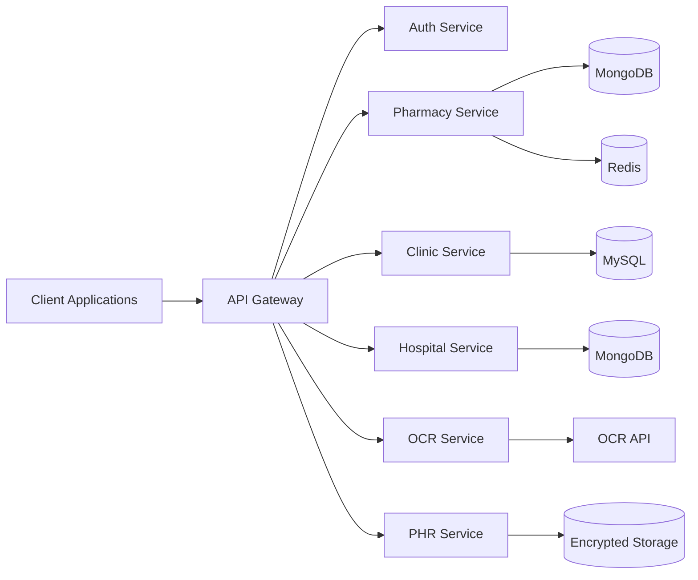

#    <p align="center">                    Medoryx — Local Healthcare Operating System</p>

<p align="center">
  <b>A Unified, Scalable Healthcare Infrastructure Platform</b><br/>
  <i>Real-time visibility across medicines, clinics, hospitals and patient records</i>
</p>

<p align="center">
  
  
  
  
  
</p>

<p align="center">
  
  
  
  
</p>

---

## Overview

Medoryx is a modular, industry-grade healthcare platform designed to eliminate inefficiencies in India’s local medical ecosystem.

It provides a unified layer for:

* Medicine availability
* Pharmacy operations
* Clinic workflows
* Hospital infrastructure
* Patient health records

Medoryx is designed as a **healthcare operating system**, not just an application.

---

## Problem → Solution Mapping

| Problem                            | Medoryx Solution                   |
| ---------------------------------- | ---------------------------------- |
| No real-time medicine availability | Live pharmacy network              |
| Medicine wastage                   | Expiry tracking and redistribution |
| Inefficient clinic queues          | Digital token and live queue       |
| No hospital bed visibility         | Real-time bed tracking             |
| Prescription errors                | OCR-based digitization             |
| Fragmented health records          | Unified personal health file       |

---

## Core Modules

<details>
<summary>View Modules</summary>

### Medicine Availability

* Real-time search
* Nearby pharmacy discovery
* Live stock updates
* Prescription-based matching

---

### Expiry Management

* Batch-level tracking
* Expiry alerts
* Discounted near-expiry distribution
* Pharmacy-to-pharmacy exchange

---

### Clinic Appointment and Queue System

* Appointment booking
* QR-based tokens
* Live queue tracking
* SMS notifications

---

### Hospital Bed Availability

* ICU, NICU, general and ventilator filters
* Real-time updates
* Emergency access interface

---

### Prescription Digitizer

* OCR-based extraction
* Structured dosage information
* Medication reminders

---

### Personal Health File

* Secure document storage
* Tagging and indexing
* Family profile management

</details>

---

## System Architecture

### High-Level Flow



---

## Service-Level Architecture



---

## Project Structure

```bash
medoryx/
├── apps/
├── services/
├── api-gateway/
├── shared/
├── infrastructure/
├── databases/
├── config/
├── scripts/
├── docs/
├── tests/
└── docker-compose.yml
```

---

## Technology Stack

### Frontend

* Next.js
* React.js
* Tailwind CSS

### Backend

* Node.js
* Express

### Databases

* MongoDB
* MySQL

### Integrations

* OCR (Google Vision / AWS Textract)
* SMS Gateway (Twilio / Fast2SMS)
* OTP Authentication

---

## Scalability

* Microservices architecture
* Containerization using Docker
* Redis caching for performance
* Load balancing
* Independent service deployment

---

## Reliability and Maintainability

* MVC-based architecture
* Role-Based Access Control (RBAC)
* Centralized logging and monitoring
* Encrypted data storage
* CI/CD pipeline readiness

---

## Current Status

```diff
+ Architecture designed
+ Core modules defined
+ Initial backend services under development
- Deployment pipeline pending
- OCR pipeline integration pending
- Real-time synchronization optimizations pending
```

The system is being built with a production-first mindset, ensuring scalability and extensibility.

---

## Vision

To become the default digital infrastructure layer for local healthcare systems, enabling seamless coordination between patients, pharmacies, clinics, and hospitals.

---

## Contribution

The project is currently under development. Contributions, feedback, and collaboration discussions are welcome.

---

<p align="center">
  Rashmi Anand
</p>
